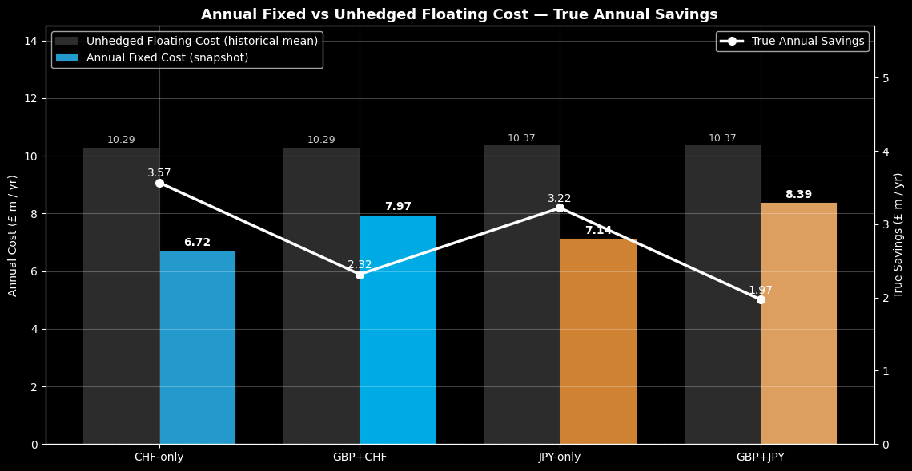
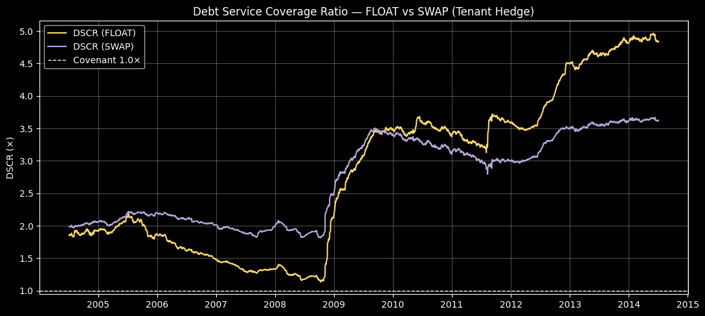
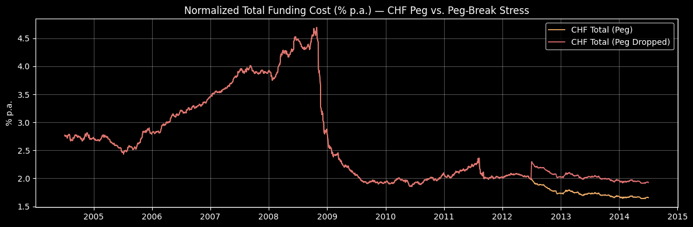

<!-- .slide: class="title-slide" -->
# Group Project #1 : Financial Risk Management

Group 2: Cook, Katie. Khan, Mohammad. Riofrio Lara, Andres. Wen, Xinyu. & Zhou, An | <em>October 15th, 2025</em>

</section>

---

## BLUF
- **Acquire** London office for **GBP 600m**.
- **Finance:** **GBP 400m debt** + **GBP 200m equity**.
- **Debt mix:** **GBP 300m foreign (CHF)** + **GBP 100m local (GBP)**.
- **Hedge:** **Payer-fixed CHF swap** on the GBP 300m foreign tranche; **tenant hedge** fixes **20%** of rent (**10% GBP + 10% CHF**).
- **Deal economics:** **3.6% yield**, **2% cap appreciation**, **2% rent growth**.
- **Result:** Lowest expected cost (≈ **GBP 3.57m/yr** savings vs float) with **DSCR ≥ 1.0×** across key stresses and **Equity > GBP 100m**.

---

## Context
- **Window:** **2004-07-03 → 2014-07-03** (daily FX/rates); **snapshot:** **2014-07-03**.
- **FX daily log returns:** mean **GBP/CHF −0.0149%**, **GBP/JPY −0.0050%**; vol **0.64%** (CHF), **0.83%** (JPY).
- **1Y LIBOR means:** **CHF 1.16%**, **JPY 0.60%**, **GBP 3.18%** → foreign floating cheaper than GBP.
- **Spreads vs GBP:** **GBP–CHF ~87 bps**, **GBP–JPY ~73 bps** (below memo **125/110 bps**).
- **Structural context:** **SNB EUR/CHF floor (1.20)** in 2011–2014; **tenant CHF linkage**.

---

## Problem
- **Objective:** Pick **currency mix + hedge** to **minimize funding cost** without breaking covenants.
- **Covenants:** **DSCR ≥ 1.0×**; **Equity = Property − Loan − Swap NPV ≥ 0**.
- **Risks:** SNB floor/peg risk, potential CHF appreciation, rent/property shocks; align debt with **tenant CHF exposure**.

---

## Methods
- **Data & prep:** Bloomberg / Capital IQ / Bank of London; daily FX → **log returns**; **rolling volatilities**.
- **Peg treatment:** Enforce **EUR/CHF = 1.20** during **2011–2014**.
- **Hedge designs (snapshot; fixed legs = LIBOR + 50 bps):**
  - **Foreign-only fixed:** CHF or JPY (GBP leg floating).
  - **Both-legs-fixed:** GBP+CHF or GBP+JPY.
  - **Tenant hedge:** fix **20%** of rent (**10% GBP + 10% CHF**).
- **Risk metrics:** **Hist-sim VaR/ES** on **savings = FLOAT − FIXED**; **DV01** to parallel shifts.
- **Stresses:** **Rent −20%**, **Property −20%**, **CHF +10%**, **combined**, **CHF peg-break +30%**, **EUR/CHF −20% (2012–2014)**.

--
## Key Figures

--

**Cost & savings by hedge (pick CHF-only)**

  

--

**Covenant protection — DSCR paths (swap vs float)**

  

--

**Risk check — SNB peg stress on total cost**

  

---

## Recommendation
- **Choose:** **Payer-fixed CHF swap** on **GBP 300m foreign**; **retain tenant hedge**.
- **Fixed annual costs (snapshot):** **GBP 6.72m (CHF-only)** vs float benchmarks **GBP 10.29m (CHF)** / **GBP 10.37m (JPY)**.
- **Savings vs float:** **≈ GBP 3.57m/yr (CHF-only)**; **GBP 3.22m/yr (JPY-only)**; **GBP 2.32m/yr (GBP+CHF)**; **GBP 1.97m/yr (GBP+JPY)**.
- **Resilience:** Base **DSCR ~2.7–2.8×**; swap stays **≥ 1.46–1.69×** under combined/peg stresses; **Equity ~GBP 406m** (no collateral).

---

## Q&A
